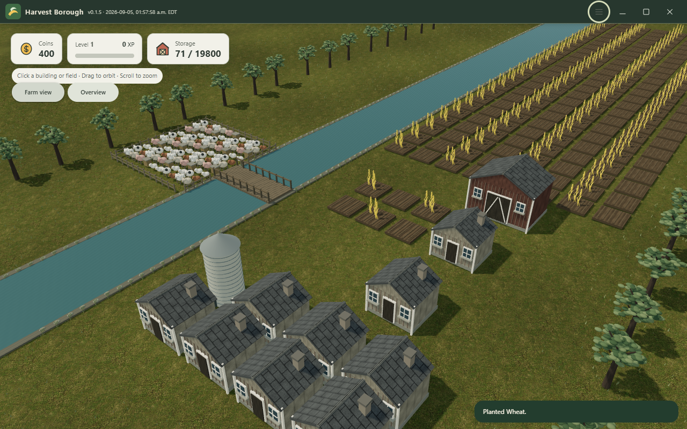
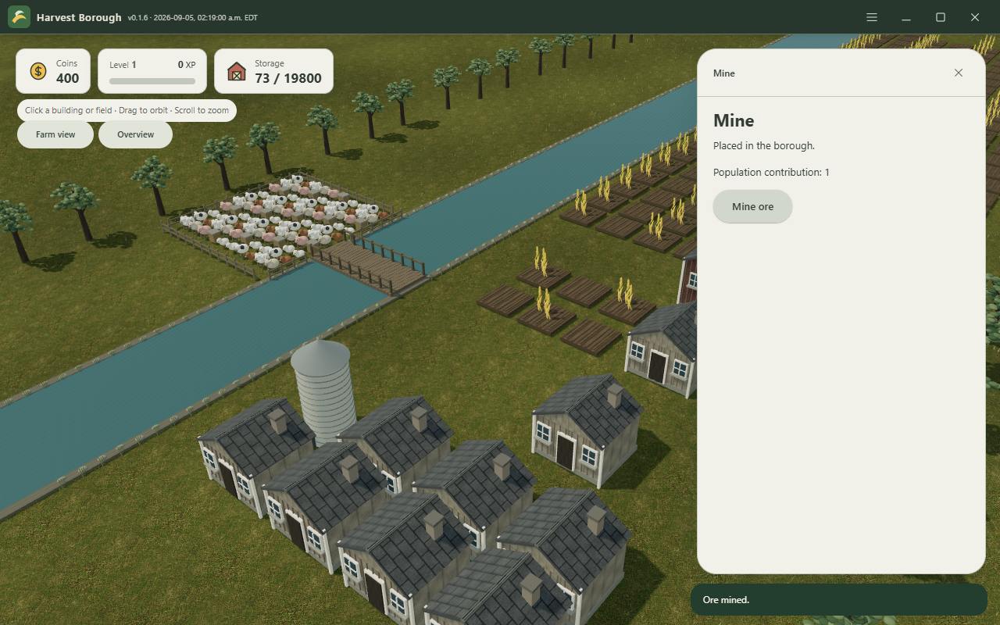
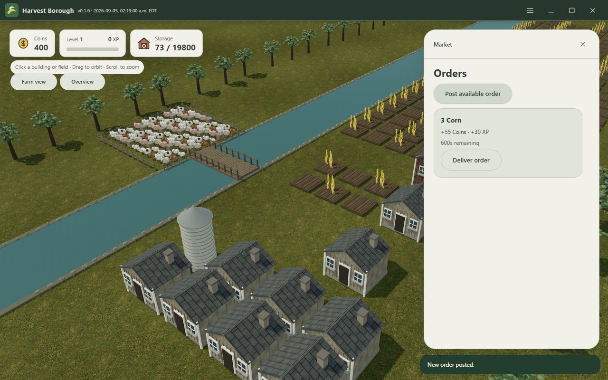
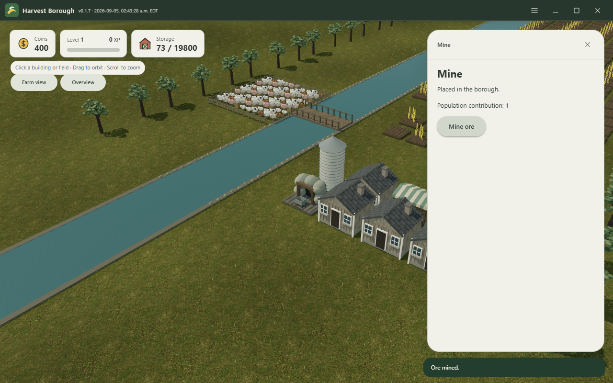
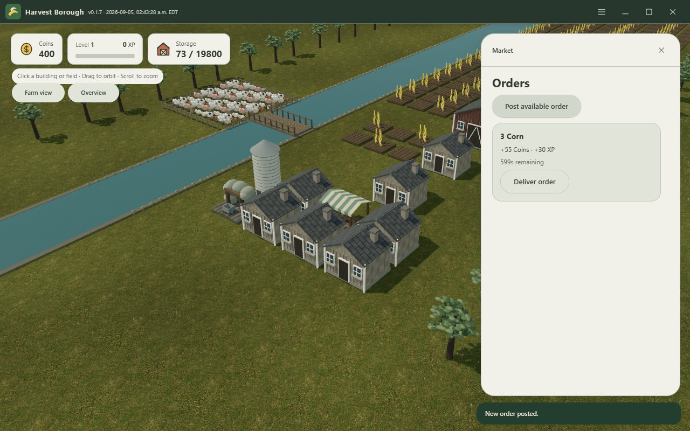
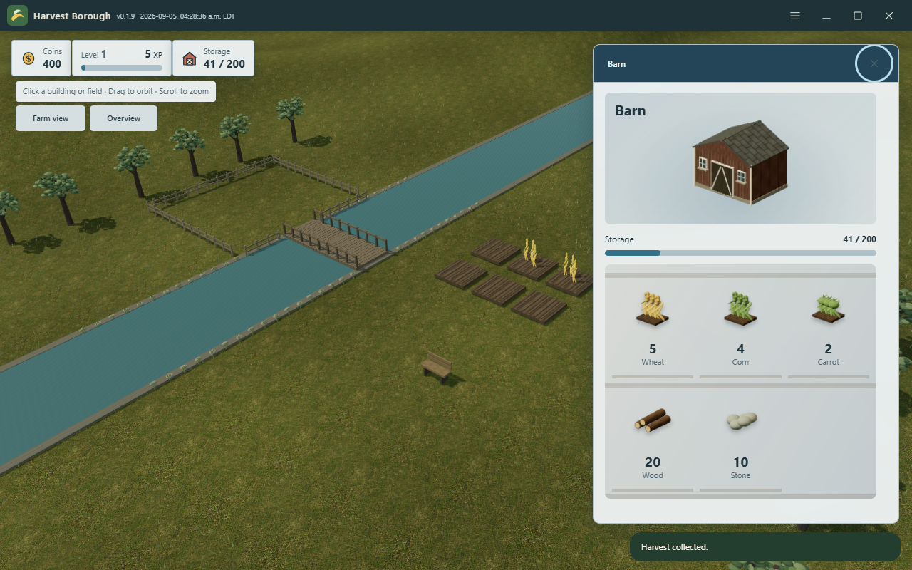
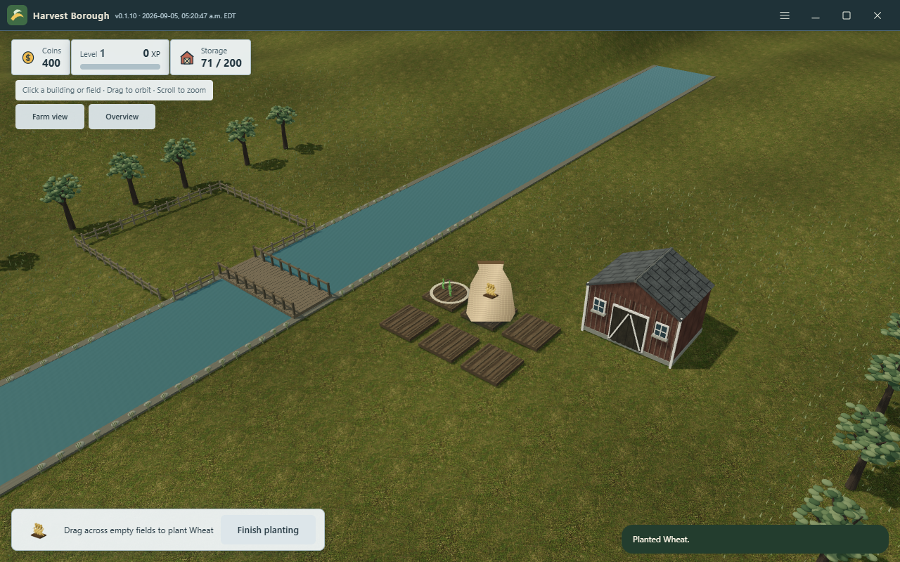

# Harvest Borough

Official downloads and documentation for an original 3D farming and town-building game for Windows and Android.

**Development status:** no verified installer or APK is available yet. This repository holds the public website, documentation, and release assets. It does not contain the playable game source or backend configuration.

## Website

[Open the official website](https://ding-ding-projects.github.io/harvest-borough-downloads/).

This repository publishes the public website through GitHub Pages. It documents the installed game and never hosts gameplay. Version-specific download links appear only after release assets are verified.

The responsive layout supports phone widths from 320 pixels, with labelled bottom navigation, safe-area spacing, touch-sized actions and internally bounded content. Desktop keeps the side navigation.

## Development

Use Node.js 22.13 or newer, then `npm ci` and `npm run build:pages`. The static output is `dist/pages`; `npm run check:pages` checks its canonical URL and project-relative asset paths locally. The publication workflow builds and deploys this directory without test or lint jobs. `npm run dev` retains the existing Sites authoring workflow, and `npm run build` retains its Worker build.

Release and installation boundaries

Windows releases use unsigned Squirrel.Windows installers. Android releases use a stable self-signed release identity. Updates remain user-confirmed. No Android signing material, server credentials, private implementation, or operational host information belongs in this repository.

Core play is planned to be free, with optional currency and cosmetic purchases. There is no live checkout or fabricated price in the initial website.

Evidence and remaining work

The initial website contains original branding, navigation, planned-feature descriptions, download availability, documentation search, and persisted light/dark appearance. The complete localization, advanced settings, advanced regex, per-element customization, and universal-tool equivalents are not complete. Verified desktop 0.1.5 captures are now included below. Their capacity fixture does not establish earned progression, native installer execution or update acceptance. Brand illustrations are explicitly labelled as illustrations.

Verified desktop 0.1.5 captures

Actual built desktop screens captured on 2026-09-05 from source `e560ee7604a40e8dd9eade65e2db4f11686f38d1`. These show an imported capacity fixture. They are not concept art or a claim of complete commercial-quality art.

The [capture manifest](public/captures/manifest.json) records exact image and executable hashes. No private implementation or operational path is included.

Verified desktop 0.1.6 mine and market

Real world selections from source `89e3f3ab1bc0ed2347df8661a8403c9a11117cd2`. The mine produced one saved ore and the market posted one saved order. The world is an imported capacity fixture, not earned progression.

Verified desktop 0.1.7 distinct building models

Actual runnable source `3245db20fd9b28bb4a2042ccaeed70b666e3c0f3`, with the original mine portal and open market canopy. Activities still operate through the buildings. The world is a prepared capacity fixture. The newer graphical-panel and one-gigabyte content requirements are not complete.

Version 0.1.9: graphical barn and saved gameplay

Captured from source 21e6b6de7b3b97e08d9b95318b1f26561a5b9746 through an isolated off-screen runnable desktop build. This is a real new-save and reopened harvest flow, not a capacity fixture. Native installation and second-version updates remain unverified.

Version 0.1.10: direct seed dragging

Real runnable source 3834b565c332f3264a5c72472fb6a48d804ae501. Dragging, cancellation, mature-crop sweeping and reopening were exercised. Other activity panels still need direct-manipulation conversion.

